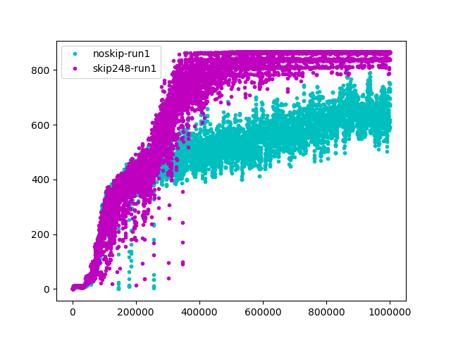
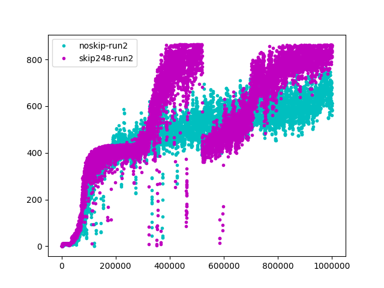
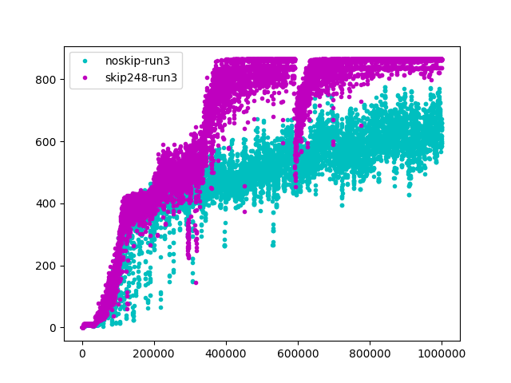
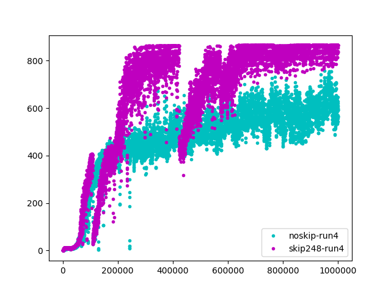

# Learn to skip frames in RL (WIP)

### Description
- Idea of Nako Sung, add auxiliary actions to skip N states, during which perform (N+1) no_op (no operation) actions or random actions or repeat last non random action.  <br />
- In some environments eg Pong, Breakout when the ball is not near agent, agent can afford perform random actions.  <br />
- This auxilliary actions hopefully can speed-up training by faster reward propogation due to skiping unnecessary states. <br />
- Agent is incentivised to skip frames when possible due to less discount on immediate state right after skipped N. <br />

### Run
```sh
python main.py
```

### Results
Results of 4 runs with different random seed values Breakout (deepmind environment setup).
skip248 reaches the maximum score for the game 864 with 4 lives out of 5. After that the game does not restart. Sample video at `atari/videos`.
noskip does not reach it, which means loses all 5 lives.

   |  
:-------------------------------------------:|:-------------------------------------------------:
   |  

### Thoughts
skip248 convergence value is ~850, while noskip 600-650. They learn at comparatively same speed until reward of 400-500, the reward level when agent learns to play the game and can control the ball. We guess after that noskip spend resources on unnecessary updates, when the ball is not near agent. While skip248 skip those frames, to learn something on top of what already learnt.

skip248 experiences sometime performance drop. Reason: magnitude of accumulated reward is higher, due to skip248 for one a2c update of 5 steps in environment, actual number steps in environment is larger. Thus, larger gradient norm of bellman update.

### Todo
1) Environments get results from <br />
Atari: Skiing, VideoPinball, Tennis, Pong <br />
Deepmind lab: stairway_to_melon

