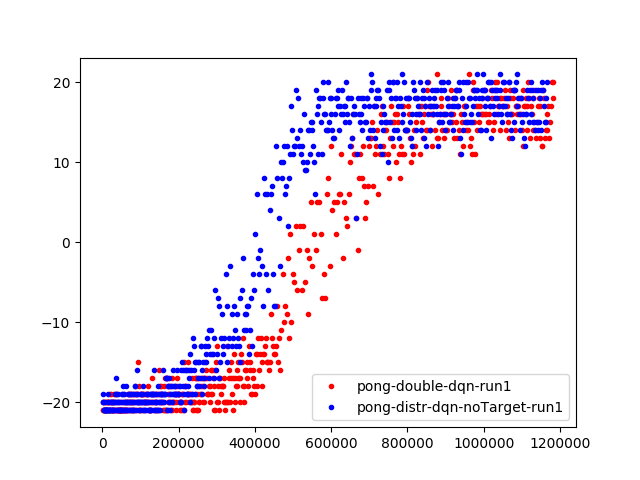
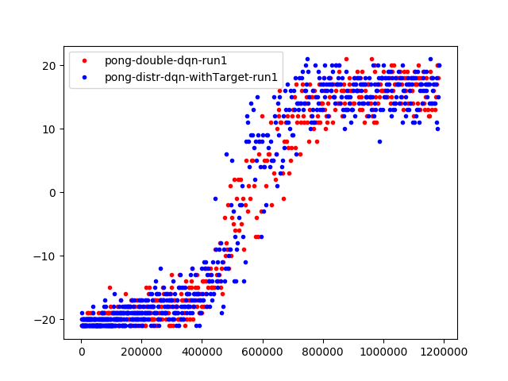

# A Distributional Perspective on Reinforcement Learning

https://arxiv.org/abs/1707.06887

### Description
Paper maintains value distribution of future cumulative random return. Instead of having expectation estimate of it as Q. They change Bellman update in Q learning into distributional form.

### Results of DQN
   |  
:-----------------------------------------------------:|:-----------------------------------------------------: